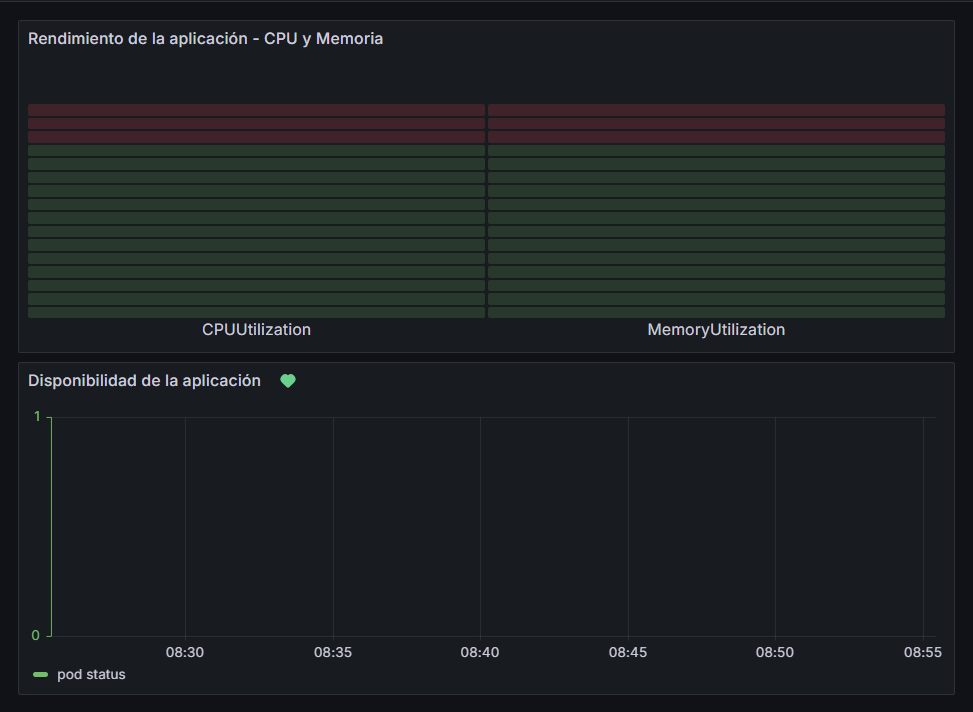

# WeatherApp
Aplicación del clima. Realiza consultas a travez de la API de [OpenWeatherMap](https://openweathermap.org/api) para obtener datos meteorológicos de una ubicación en particular proporsionando latitud y longitud.

## Ejemplo

Endpoint:

    /real_weather?lat=-34.61315&lon=-58.37723

Output:
```json
{
  "country": "AR",
  "description": "clear sky",
  "humidity": 67,
  "location": "Buenos Aires",
  "temperature": 12.43
}
```


El repositorio está diseñado para desplegar la aplicación en un cluster de EKS.

## Infraestructura de la aplicación
### Ejecutar el pipeline de CI/CD
El pipeline de CI/CD se configura a través de GitHub Actions. Cada vez que se realice un `push` o una `pull request` en la rama `feature/master`, el pipeline se ejecutará automáticamente.

#### Pasos para ejecutar el pipeline:
1. Clonar el repositorio:

    ```bash
    git clone -b feature/master https://github.com/ddecampos/weather-app.git
    cd weather-app
    ```

2. Configurar las variables de entorno:

    Se configuran las variables necesarias en los secrets del repositorio. Esto incluye las credenciales de AWS (Access Key y Secret Key) y otras variables como WEATHER_API_KEY.

3. Hacer un `push` o `pull request`:

    ```bash
    git add .
    git commit -m "Descripción de los cambios"
    git push origin feature/nombre_de_la_branch
    ```

### Desplegar la infraestructura
El despliegue del clúster de Kubernetes (EKS) se realiza mediante Terraform.

#### Pasos para desplegar

1. Tener las credenciales de AWS previamente configuradas.

2. Inicializa y aplica Terraform dentro del directorio donde se encuentra el archivo `main.tf`, ejecuta:

    ```bash
    cd terraform
    terraform init
    terraform plan
    terraform apply
    ```
    Esto creará el clúster de EKS y los recursos asociados.

3. Una vez desplegada la infraestructura, conectamos kubectl con el clúster EKS:

    ```bash
    aws eks --region <region> update-kubeconfig --name <eks-cluster-name>
    ```

### Acceder a la aplicación
Una vez que el despliegue esté completo, accedemos a la aplicación a través del servicio `LoadBalancer` creado en Kubernetes.

#### Obtener URL de acceso:
1. Ejecuta el siguiente comando para obtener la dirección IP:

    ```bash
    kubectl get services
    ```
    El `EXTERNAL-IP` del servicio `LoadBalancer` te permitirá acceder a la aplicación en el navegador.

2. Abre la URL en el navegador para verificar que la aplicación está en funcionamiento.

### Monitorear la aplicación utilizando Grafana
El monitoreo de la aplicación se realiza mediante Grafana, conectado a CloudWatch para recibir métricas del clúster de EKS.

#### Pasos para monitorear
1. Crear el `namespace` para Grafana:
    ```bash
    kubectl create namespace monitoring
    ```

2. Agregar el Repositorio de Grafana en Helm:
    ```bash
    helm repo add grafana https://grafana.github.io/helm-charts
    helm repo update
    ```

3. Instalar Grafana con Helm y exponerlo a través de un LoadBalancer:
    ```bash
    helm install grafana grafana/grafana \
    --namespace monitoring \
    --set adminPassword='admin' \
    --set service.type=LoadBalancer
    ```

4. Verificar la Instalación:
    ```bash
    kubectl get all -n monitoring
    ```
    Verificamos que el Pod de Grafana esté en el estado `Running` y que el servicio de tipo `LoadBalancer` haya obtenido una IP externa.

5. Obtener la URL de Grafana:
    ```bash
    kubectl get svc -n monitoring
    ```
    El `EXTERNAL-IP` te permitire acceder a la aplicación en el navegador.

6. Ingresar a la instancia de Grafana configurada:

        http://<EXTERNAL-IP>

7. Conectar Grafana con AWS CloudWatch: 
    
    En el panel de Grafana, configuramos el datasource de AWS CloudWatch con las credenciales de AWS.

8. Creación de Dashboards: 

    El dashboard básico configurado muestra el estado del clúster, incluyendo el uso de CPU, memoria y la disponibilidad de la aplicación.

9. Configuración de Alertas:
    
    Se ha configurado una alerta básica que envia una notificación si la aplicación deja de estar disponible.

## Capturas de Pantalla

### Dashboards



### Alerta configurada

```yaml
apiVersion: 1
groups:
    - orgId: 1
      name: Grupo
      folder: Alertas
      interval: 1m
      rules:
        - uid: fdz0zdbhc0yrkf
          title: Disponibilidad de la aplicación
          condition: D
          data:
            - refId: A
              relativeTimeRange:
                from: 1800
                to: 0
              datasourceUid: fdz0ut4pw7m68e
              model:
                alias: ""
                datasource:
                    type: cloudwatch
                    uid: fdz0ut4pw7m68e
                dimensions: {}
                expression: ""
                id: ""
                intervalMs: 1000
                label: ""
                logGroups: []
                matchExact: true
                maxDataPoints: 43200
                metricEditorMode: 0
                metricName: pod_status
                metricQueryType: 0
                namespace: AWS/EKS
                period: ""
                queryMode: Metrics
                refId: A
                region: us-east-2
                sqlExpression: ""
                statistic: Average
            - refId: D
              datasourceUid: __expr__
              model:
                conditions:
                    - evaluator:
                        params:
                            - 1
                            - 0
                        type: lt
                      operator:
                        type: when
                      query:
                        params:
                            - A
                      reducer:
                        params: []
                        type: avg
                      type: query
                datasource:
                    name: Expression
                    type: __expr__
                    uid: __expr__
                expression: ""
                intervalMs: 1000
                maxDataPoints: 43200
                refId: D
                type: classic_conditions
          dashboardUid: fdz0w24yh6sqof
          panelId: 1
          noDataState: NoData
          execErrState: Error
          for: 1m
          annotations:
            __dashboardUid__: fdz0w24yh6sqof
            __panelId__: "1"
            description: ""
            runbook_url: ""
            summary: ""
          labels:
            "": ""
          isPaused: false
```
    
